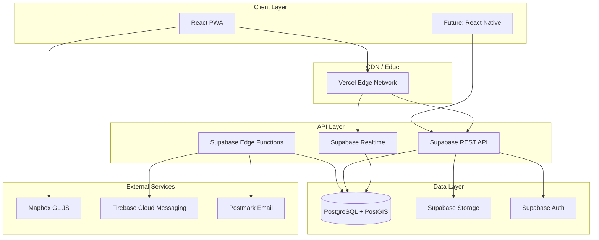
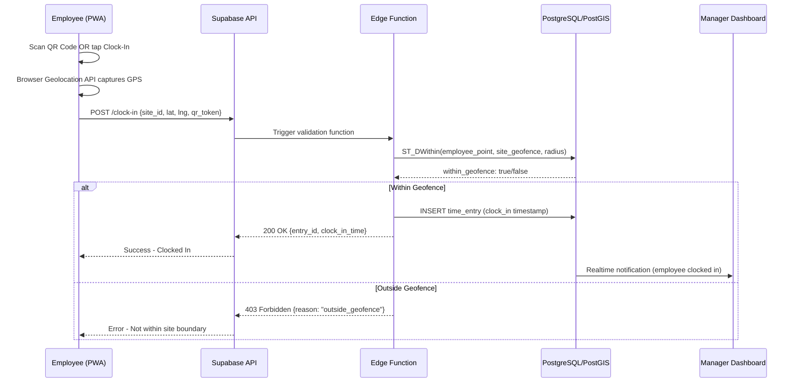
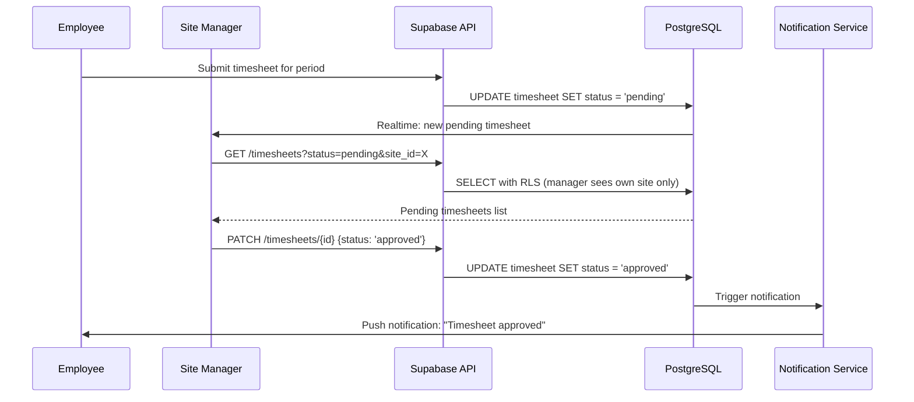
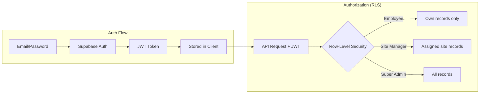
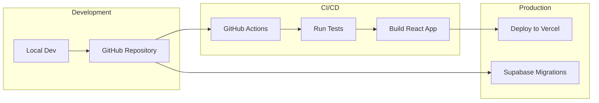

# System Architecture

## Overview

The Tyrepower Workforce Management Platform follows a modern JAMstack architecture with a React frontend, Supabase backend (PostgreSQL + PostGIS), and serverless functions for business logic.

---

## Architecture Diagram

---

## Layer Descriptions

### 1. Client Layer (Frontend)

| Component | Technology | Responsibility |
|-----------|-----------|----------------|
| Web App | React.js + TailwindCSS | UI rendering, form handling, routing |
| PWA Shell | Workbox | Offline support, caching, install prompt |
| Maps | Mapbox GL JS | Geofence visualization, location display |
| QR Scanner | react-qr-reader | Camera access, QR code decoding |
| State Management | React Context / Zustand | Client-side state, auth state |

### 2. Edge / CDN Layer

| Component | Technology | Responsibility |
|-----------|-----------|----------------|
| Static Hosting | Vercel | CDN delivery, automatic HTTPS, preview deploys |
| Edge Functions | Vercel Edge (optional) | Middleware, redirects, geo-routing |

### 3. API Layer (Backend)

| Component | Technology | Responsibility |
|-----------|-----------|----------------|
| REST API | Supabase Auto-generated | CRUD operations on all tables |
| Realtime | Supabase Realtime | WebSocket connections for live updates |
| Edge Functions | Supabase Edge Functions (Deno) | Custom business logic, validations |
| Auth | Supabase Auth (GoTrue) | JWT issuance, session management |

### 4. Data Layer

| Component | Technology | Responsibility |
|-----------|-----------|----------------|
| Relational DB | PostgreSQL 15+ | Core data storage, ACID compliance |
| Geospatial | PostGIS extension | Geofence calculations, distance queries |
| File Storage | Supabase Storage | QR images, profile photos, assets |
| Row-Level Security | PostgreSQL RLS | Role-based data access enforcement |

### 5. External Services

| Service | Purpose | Cost |
|---------|---------|------|
| Mapbox GL JS | Map rendering & geofence visualization | Free tier: 25K loads/month |
| Firebase Cloud Messaging | Push notifications to PWA/mobile | Free |
| Postmark | Transactional email delivery | Free tier available |

---

## Data Flow Diagrams

### Clock-In Flow

### Timesheet Approval Flow

---

## Security Architecture

### Authentication & Authorization

### Role Hierarchy

| Role | Access Level | Description |
|------|-------------|-------------|
| Employee | Own data | View/edit own time entries, profile |
| Site Manager | Site-scoped | Manage employees & timesheets for assigned sites |
| Super Admin | Global | Full access to all data, settings, and reports |

### Security Measures

- **Transport**: HTTPS everywhere (enforced by Vercel + Supabase)
- **Authentication**: JWT with short-lived access tokens + refresh tokens
- **Authorization**: PostgreSQL Row-Level Security policies on every table
- **Input Validation**: Edge Functions validate all inputs before DB operations
- **Rate Limiting**: Supabase built-in rate limiting on auth endpoints
- **CORS**: Strict origin policies on API endpoints
- **Storage**: Signed URLs for file access with expiry

---

## Deployment Architecture

### Environments

| Environment | Purpose | Database | URL |
|-------------|---------|----------|-----|
| Local | Development | Local Supabase (Docker) | localhost:3000 |
| Staging | Testing & QA | Supabase project (staging) | staging.app.tyrepower.com |
| Production | Live users | Supabase project (prod) | app.tyrepower.com |

---

## Scalability Considerations

### Horizontal Scaling (Automatic)
- **Vercel**: Auto-scales frontend globally via CDN
- **Supabase**: Managed PostgreSQL with connection pooling (PgBouncer)
- **Edge Functions**: Serverless, auto-scales with invocations

### Performance Optimizations
- **Database Indexes**: On frequently queried columns (site_id, employee_id, timestamps)
- **PostGIS Spatial Indexes**: GIST indexes on geometry columns
- **Connection Pooling**: PgBouncer handles concurrent connections
- **Client Caching**: Service worker caches static assets and API responses
- **Realtime Subscriptions**: Only subscribe to relevant channels per user role

### Limits & Thresholds

| Resource | Free Tier | Pro Tier | Action When Exceeded |
|----------|-----------|----------|---------------------|
| Database | 500 MB | 8 GB | Upgrade to Pro ($25/mo) |
| Edge Function Invocations | 50K/mo | 2M/mo | Monitor usage dashboard |
| Realtime Connections | 200 concurrent | 500 concurrent | Optimize subscription scope |
| Storage | 1 GB | 100 GB | Archive old files |
| Bandwidth | 2 GB | 250 GB | CDN handles most static |

---

## Offline Capabilities (PWA)

### Service Worker Strategy

| Resource | Cache Strategy | Reason |
|----------|---------------|--------|
| Static assets (JS/CSS) | Cache-first | Rarely changes after deploy |
| API data (timesheets) | Network-first, cache fallback | Needs fresh data, works offline |
| Map tiles | Cache with expiry | Reduce Mapbox calls |
| QR code images | Cache-first | Static per site |

### Offline Clock-In

When offline, the PWA will:
1. Store clock-in attempt locally (IndexedDB)
2. Capture GPS coordinates
3. Queue the request
4. Sync when connection restored
5. Show "pending sync" indicator to user

---

## Technology Decision Records

| Decision | Choice | Rationale |
|----------|--------|-----------|
| Frontend Framework | React.js | Large ecosystem, React Native path for mobile |
| CSS | TailwindCSS | Rapid prototyping, small bundle, responsive |
| Backend | Supabase | All-in-one (DB, Auth, Functions, Storage, Realtime) |
| Database | PostgreSQL + PostGIS | Geospatial native, RLS, mature |
| Hosting | Vercel | Zero-config React deploys, great DX |
| Maps | Mapbox GL JS | Free tier generous, customizable, performant |
| Notifications | FCM + Postmark | Free push, reliable email |
| CI/CD | GitHub Actions | Integrated with repo, free tier generous |
