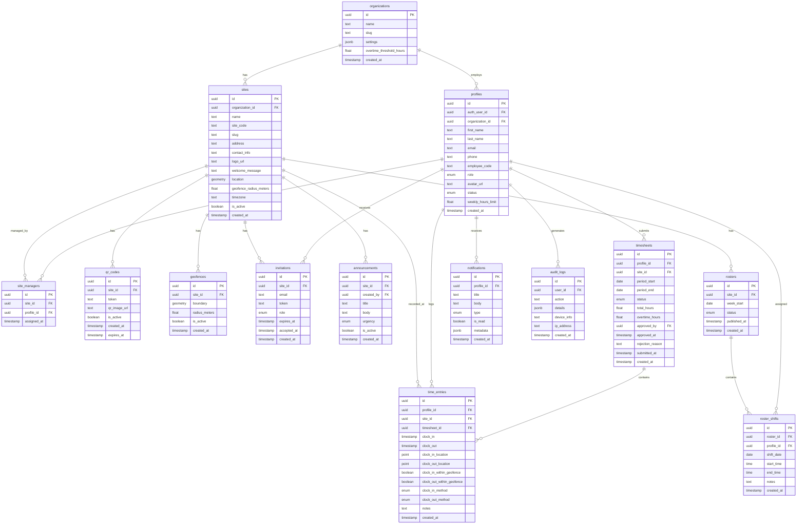

# Database Schema Design

## Overview

The database uses PostgreSQL with the PostGIS extension for geospatial queries. Supabase provides the managed PostgreSQL instance with Row-Level Security (RLS) for role-based access control.

---

## Entity Relationship Diagram



---

## Table Definitions

### `organizations`

The top-level entity representing a Tyrepower franchise or business unit.

```sql
CREATE TABLE organizations (
    id UUID PRIMARY KEY DEFAULT gen_random_uuid(),
    name TEXT NOT NULL,
    slug TEXT UNIQUE NOT NULL,
    settings JSONB DEFAULT '{}',
    overtime_threshold_hours FLOAT NOT NULL DEFAULT 38,
    created_at TIMESTAMPTZ DEFAULT NOW(),
    updated_at TIMESTAMPTZ DEFAULT NOW()
);
```

### `profiles`

Extended user profiles linked to Supabase Auth users.

```sql
CREATE TYPE user_role AS ENUM ('employee', 'site_manager', 'super_admin');
CREATE TYPE user_status AS ENUM ('active', 'suspended', 'removed');

CREATE TABLE profiles (
    id UUID PRIMARY KEY DEFAULT gen_random_uuid(),
    auth_user_id UUID UNIQUE REFERENCES auth.users(id) ON DELETE CASCADE,
    organization_id UUID REFERENCES organizations(id) ON DELETE CASCADE,
    first_name TEXT NOT NULL,
    last_name TEXT NOT NULL,
    email TEXT NOT NULL,
    phone TEXT,
    employee_code TEXT,
    role user_role NOT NULL DEFAULT 'employee',
    status user_status NOT NULL DEFAULT 'active',
    avatar_url TEXT,
    weekly_hours_limit FLOAT DEFAULT 38,
    suspended_at TIMESTAMPTZ,
    suspended_reason TEXT,
    removed_at TIMESTAMPTZ,
    created_at TIMESTAMPTZ DEFAULT NOW(),
    updated_at TIMESTAMPTZ DEFAULT NOW()
);

CREATE INDEX idx_profiles_org ON profiles(organization_id);
CREATE INDEX idx_profiles_role ON profiles(role);
CREATE INDEX idx_profiles_status ON profiles(status);
CREATE INDEX idx_profiles_auth_user ON profiles(auth_user_id);
CREATE INDEX idx_profiles_employee_code ON profiles(employee_code);
```

### `sites`

Physical locations (Tyrepower stores/workshops).

```sql
CREATE TABLE sites (
    id UUID PRIMARY KEY DEFAULT gen_random_uuid(),
    organization_id UUID REFERENCES organizations(id) ON DELETE CASCADE,
    name TEXT NOT NULL,
    site_code TEXT,
    slug TEXT UNIQUE NOT NULL,
    address TEXT NOT NULL,
    contact_info TEXT,
    logo_url TEXT,
    welcome_message TEXT,
    location GEOMETRY(Point, 4326) NOT NULL,
    geofence_radius_meters FLOAT NOT NULL DEFAULT 100,
    timezone TEXT NOT NULL DEFAULT 'Australia/Sydney',
    is_active BOOLEAN DEFAULT true,
    created_at TIMESTAMPTZ DEFAULT NOW(),
    updated_at TIMESTAMPTZ DEFAULT NOW()
);

CREATE INDEX idx_sites_org ON sites(organization_id);
CREATE INDEX idx_sites_slug ON sites(slug);
CREATE INDEX idx_sites_location ON sites USING GIST(location);
```

### `site_managers`

Junction table linking managers to their assigned sites.

```sql
CREATE TABLE site_managers (
    id UUID PRIMARY KEY DEFAULT gen_random_uuid(),
    site_id UUID REFERENCES sites(id) ON DELETE CASCADE,
    profile_id UUID REFERENCES profiles(id) ON DELETE CASCADE,
    assigned_at TIMESTAMPTZ DEFAULT NOW(),
    UNIQUE(site_id, profile_id)
);

CREATE INDEX idx_site_managers_site ON site_managers(site_id);
CREATE INDEX idx_site_managers_profile ON site_managers(profile_id);
```

### `geofences`

Geofence boundaries for sites (supports complex polygons beyond simple radius).

```sql
CREATE TABLE geofences (
    id UUID PRIMARY KEY DEFAULT gen_random_uuid(),
    site_id UUID REFERENCES sites(id) ON DELETE CASCADE,
    boundary GEOMETRY(Polygon, 4326),
    radius_meters FLOAT NOT NULL DEFAULT 100,
    is_active BOOLEAN DEFAULT true,
    created_at TIMESTAMPTZ DEFAULT NOW(),
    updated_at TIMESTAMPTZ DEFAULT NOW()
);

CREATE INDEX idx_geofences_site ON geofences(site_id);
CREATE INDEX idx_geofences_boundary ON geofences USING GIST(boundary);
```

### `qr_codes`

Site-specific QR codes for clock-in verification.

```sql
CREATE TABLE qr_codes (
    id UUID PRIMARY KEY DEFAULT gen_random_uuid(),
    site_id UUID REFERENCES sites(id) ON DELETE CASCADE,
    token TEXT UNIQUE NOT NULL DEFAULT encode(gen_random_bytes(32), 'hex'),
    qr_image_url TEXT,
    is_active BOOLEAN DEFAULT true,
    created_at TIMESTAMPTZ DEFAULT NOW(),
    expires_at TIMESTAMPTZ,
    CONSTRAINT valid_expiry CHECK (expires_at IS NULL OR expires_at > created_at)
);

CREATE INDEX idx_qr_codes_site ON qr_codes(site_id);
CREATE INDEX idx_qr_codes_token ON qr_codes(token);
```

### `time_entries`

Individual clock-in/clock-out records.

```sql
CREATE TYPE clock_method AS ENUM ('gps', 'qr_code', 'manual', 'admin_override');

CREATE TABLE time_entries (
    id UUID PRIMARY KEY DEFAULT gen_random_uuid(),
    profile_id UUID REFERENCES profiles(id) ON DELETE CASCADE,
    site_id UUID REFERENCES sites(id) ON DELETE CASCADE,
    timesheet_id UUID REFERENCES timesheets(id) ON DELETE SET NULL,
    clock_in TIMESTAMPTZ NOT NULL,
    clock_out TIMESTAMPTZ,
    clock_in_location GEOMETRY(Point, 4326),
    clock_out_location GEOMETRY(Point, 4326),
    clock_in_within_geofence BOOLEAN DEFAULT false,
    clock_out_within_geofence BOOLEAN,
    clock_in_method clock_method NOT NULL DEFAULT 'gps',
    clock_out_method clock_method,
    notes TEXT,
    created_at TIMESTAMPTZ DEFAULT NOW(),
    updated_at TIMESTAMPTZ DEFAULT NOW(),
    CONSTRAINT valid_clock_times CHECK (clock_out IS NULL OR clock_out > clock_in)
);

CREATE INDEX idx_time_entries_profile ON time_entries(profile_id);
CREATE INDEX idx_time_entries_site ON time_entries(site_id);
CREATE INDEX idx_time_entries_timesheet ON time_entries(timesheet_id);
CREATE INDEX idx_time_entries_clock_in ON time_entries(clock_in);
CREATE INDEX idx_time_entries_date_range ON time_entries(profile_id, clock_in, clock_out);
```

### `timesheets`

Aggregated time periods for approval workflows.

```sql
CREATE TYPE timesheet_status AS ENUM ('draft', 'submitted', 'reviewed', 'approved', 'rejected');

CREATE TABLE timesheets (
    id UUID PRIMARY KEY DEFAULT gen_random_uuid(),
    profile_id UUID REFERENCES profiles(id) ON DELETE CASCADE,
    site_id UUID REFERENCES sites(id) ON DELETE CASCADE,
    period_start DATE NOT NULL,
    period_end DATE NOT NULL,
    status timesheet_status NOT NULL DEFAULT 'draft',
    total_hours FLOAT DEFAULT 0,
    overtime_hours FLOAT DEFAULT 0,
    approved_by UUID REFERENCES profiles(id),
    approved_at TIMESTAMPTZ,
    rejection_reason TEXT,
    submitted_at TIMESTAMPTZ,
    created_at TIMESTAMPTZ DEFAULT NOW(),
    updated_at TIMESTAMPTZ DEFAULT NOW(),
    CONSTRAINT valid_period CHECK (period_end >= period_start)
);

CREATE INDEX idx_timesheets_profile ON timesheets(profile_id);
CREATE INDEX idx_timesheets_site ON timesheets(site_id);
CREATE INDEX idx_timesheets_status ON timesheets(status);
CREATE INDEX idx_timesheets_period ON timesheets(period_start, period_end);
```

### `notifications`

In-app notifications for users.

```sql
CREATE TYPE notification_type AS ENUM (
    'timesheet_submitted',
    'timesheet_approved',
    'timesheet_rejected',
    'clock_in_reminder',
    'clock_out_reminder',
    'geofence_violation',
    'announcement',
    'system'
);

CREATE TABLE notifications (
    id UUID PRIMARY KEY DEFAULT gen_random_uuid(),
    profile_id UUID REFERENCES profiles(id) ON DELETE CASCADE,
    title TEXT NOT NULL,
    body TEXT,
    type notification_type NOT NULL,
    is_read BOOLEAN DEFAULT false,
    metadata JSONB DEFAULT '{}',
    created_at TIMESTAMPTZ DEFAULT NOW()
);

CREATE INDEX idx_notifications_profile ON notifications(profile_id);
CREATE INDEX idx_notifications_unread ON notifications(profile_id, is_read) WHERE is_read = false;
```

---

## Row-Level Security (RLS) Policies

### Profiles Table

```sql
-- Employees can read their own profile
CREATE POLICY "Users can view own profile"
    ON profiles FOR SELECT
    USING (auth.uid() = auth_user_id);

-- Site Managers can view profiles of employees at their sites
CREATE POLICY "Managers can view site employees"
    ON profiles FOR SELECT
    USING (
        EXISTS (
            SELECT 1 FROM site_managers sm
            JOIN time_entries te ON te.site_id = sm.site_id
            WHERE sm.profile_id = (SELECT id FROM profiles WHERE auth_user_id = auth.uid())
            AND te.profile_id = profiles.id
        )
    );

-- Super Admins can view all profiles
CREATE POLICY "Admins can view all profiles"
    ON profiles FOR SELECT
    USING (
        EXISTS (
            SELECT 1 FROM profiles
            WHERE auth_user_id = auth.uid() AND role = 'super_admin'
        )
    );
```

### Time Entries Table

```sql
-- Employees can view and insert their own entries
CREATE POLICY "Employees manage own time entries"
    ON time_entries FOR ALL
    USING (
        profile_id = (SELECT id FROM profiles WHERE auth_user_id = auth.uid())
    );

-- Site Managers can view entries at their sites
CREATE POLICY "Managers view site time entries"
    ON time_entries FOR SELECT
    USING (
        EXISTS (
            SELECT 1 FROM site_managers
            WHERE site_id = time_entries.site_id
            AND profile_id = (SELECT id FROM profiles WHERE auth_user_id = auth.uid())
        )
    );

-- Super Admins can access all entries
CREATE POLICY "Admins access all time entries"
    ON time_entries FOR ALL
    USING (
        EXISTS (
            SELECT 1 FROM profiles
            WHERE auth_user_id = auth.uid() AND role = 'super_admin'
        )
    );
```

### Timesheets Table

```sql
-- Employees can manage their own timesheets
CREATE POLICY "Employees manage own timesheets"
    ON timesheets FOR ALL
    USING (
        profile_id = (SELECT id FROM profiles WHERE auth_user_id = auth.uid())
    );

-- Site Managers can view and update timesheets at their sites
CREATE POLICY "Managers manage site timesheets"
    ON timesheets FOR ALL
    USING (
        EXISTS (
            SELECT 1 FROM site_managers
            WHERE site_id = timesheets.site_id
            AND profile_id = (SELECT id FROM profiles WHERE auth_user_id = auth.uid())
        )
    );
```

---

## Key Queries

### Check if employee is within geofence

```sql
SELECT ST_DWithin(
    ST_SetSRID(ST_MakePoint($longitude, $latitude), 4326)::geography,
    s.location::geography,
    s.geofence_radius_meters
) AS within_geofence
FROM sites s
WHERE s.id = $site_id;
```

### Get employee hours for a period

```sql
SELECT
    p.first_name,
    p.last_name,
    SUM(EXTRACT(EPOCH FROM (te.clock_out - te.clock_in)) / 3600) AS total_hours
FROM time_entries te
JOIN profiles p ON p.id = te.profile_id
WHERE te.site_id = $site_id
    AND te.clock_in >= $period_start
    AND te.clock_in < $period_end
    AND te.clock_out IS NOT NULL
GROUP BY p.id, p.first_name, p.last_name
ORDER BY p.last_name;
```

### Get currently clocked-in employees at a site

```sql
SELECT
    p.first_name,
    p.last_name,
    te.clock_in,
    te.clock_in_method
FROM time_entries te
JOIN profiles p ON p.id = te.profile_id
WHERE te.site_id = $site_id
    AND te.clock_out IS NULL
ORDER BY te.clock_in DESC;
```

---

## Additional Tables (Phase 2-4)

### `invitations`

Token-based employee/manager invitation system.

```sql
CREATE TYPE invitation_role AS ENUM ('employee', 'site_manager');

CREATE TABLE invitations (
    id UUID PRIMARY KEY DEFAULT gen_random_uuid(),
    site_id UUID REFERENCES sites(id) ON DELETE CASCADE,
    invited_by UUID REFERENCES profiles(id),
    email TEXT NOT NULL,
    token TEXT UNIQUE NOT NULL DEFAULT encode(gen_random_bytes(32), 'hex'),
    role invitation_role NOT NULL DEFAULT 'employee',
    expires_at TIMESTAMPTZ NOT NULL DEFAULT (NOW() + INTERVAL '7 days'),
    accepted_at TIMESTAMPTZ,
    created_at TIMESTAMPTZ DEFAULT NOW(),
    CONSTRAINT valid_expiry CHECK (expires_at > created_at)
);

CREATE INDEX idx_invitations_site ON invitations(site_id);
CREATE INDEX idx_invitations_token ON invitations(token);
CREATE INDEX idx_invitations_email ON invitations(email);
```

### `audit_logs`

Track all important user actions for security and compliance.

```sql
CREATE TABLE audit_logs (
    id UUID PRIMARY KEY DEFAULT gen_random_uuid(),
    user_id UUID REFERENCES profiles(id),
    action TEXT NOT NULL,
    details JSONB DEFAULT '{}',
    device_info TEXT,
    ip_address INET,
    created_at TIMESTAMPTZ DEFAULT NOW()
);

CREATE INDEX idx_audit_logs_user ON audit_logs(user_id);
CREATE INDEX idx_audit_logs_action ON audit_logs(action);
CREATE INDEX idx_audit_logs_created ON audit_logs(created_at);
```

**Tracked Actions:**
- `user.login`, `user.logout`, `user.password_change`
- `shift.clock_in`, `shift.clock_out`, `shift.manual_entry`
- `timesheet.submit`, `timesheet.approve`, `timesheet.reject`, `timesheet.bulk_approve`
- `employee.invite`, `employee.suspend`, `employee.reactivate`, `employee.remove`
- `site.create`, `site.update`, `site.archive`
- `settings.update`

### `announcements`

Site-specific announcements from managers.

```sql
CREATE TYPE announcement_urgency AS ENUM ('low', 'normal', 'high');

CREATE TABLE announcements (
    id UUID PRIMARY KEY DEFAULT gen_random_uuid(),
    site_id UUID REFERENCES sites(id) ON DELETE CASCADE,
    created_by UUID REFERENCES profiles(id),
    title TEXT NOT NULL,
    body TEXT,
    urgency announcement_urgency NOT NULL DEFAULT 'normal',
    is_active BOOLEAN DEFAULT true,
    created_at TIMESTAMPTZ DEFAULT NOW(),
    updated_at TIMESTAMPTZ DEFAULT NOW()
);

CREATE INDEX idx_announcements_site ON announcements(site_id);
CREATE INDEX idx_announcements_active ON announcements(site_id, is_active) WHERE is_active = true;
```

### `rosters` (Phase 4)

Weekly roster management.

```sql
CREATE TYPE roster_status AS ENUM ('draft', 'published', 'archived');

CREATE TABLE rosters (
    id UUID PRIMARY KEY DEFAULT gen_random_uuid(),
    site_id UUID REFERENCES sites(id) ON DELETE CASCADE,
    created_by UUID REFERENCES profiles(id),
    week_start DATE NOT NULL,
    status roster_status NOT NULL DEFAULT 'draft',
    published_at TIMESTAMPTZ,
    created_at TIMESTAMPTZ DEFAULT NOW(),
    updated_at TIMESTAMPTZ DEFAULT NOW(),
    UNIQUE(site_id, week_start)
);

CREATE INDEX idx_rosters_site ON rosters(site_id);
CREATE INDEX idx_rosters_week ON rosters(week_start);
```

### `roster_shifts` (Phase 4)

Individual shift assignments within a roster.

```sql
CREATE TABLE roster_shifts (
    id UUID PRIMARY KEY DEFAULT gen_random_uuid(),
    roster_id UUID REFERENCES rosters(id) ON DELETE CASCADE,
    profile_id UUID REFERENCES profiles(id) ON DELETE CASCADE,
    shift_date DATE NOT NULL,
    start_time TIME NOT NULL,
    end_time TIME NOT NULL,
    notes TEXT,
    created_at TIMESTAMPTZ DEFAULT NOW(),
    CONSTRAINT valid_shift_times CHECK (end_time > start_time)
);

CREATE INDEX idx_roster_shifts_roster ON roster_shifts(roster_id);
CREATE INDEX idx_roster_shifts_profile ON roster_shifts(profile_id);
CREATE INDEX idx_roster_shifts_date ON roster_shifts(shift_date);
```

### `shift_swap_requests` (Phase 4)

Employee shift swap workflow.

```sql
CREATE TYPE swap_status AS ENUM ('pending', 'accepted', 'declined', 'approved', 'cancelled');

CREATE TABLE shift_swap_requests (
    id UUID PRIMARY KEY DEFAULT gen_random_uuid(),
    roster_shift_id UUID REFERENCES roster_shifts(id) ON DELETE CASCADE,
    requester_id UUID REFERENCES profiles(id),
    target_id UUID REFERENCES profiles(id),
    status swap_status NOT NULL DEFAULT 'pending',
    manager_approved_by UUID REFERENCES profiles(id),
    reason TEXT,
    created_at TIMESTAMPTZ DEFAULT NOW(),
    updated_at TIMESTAMPTZ DEFAULT NOW()
);
```

---

## Database Migrations Strategy

Migrations are managed via Supabase CLI:

```bash
# Create a new migration
supabase migration new create_profiles_table

# Apply migrations locally
supabase db reset

# Push to remote
supabase db push
```

### Migration File Naming

```
supabase/migrations/
├── 20260601000000_create_organizations.sql
├── 20260601000001_create_profiles.sql
├── 20260601000002_create_sites.sql
├── 20260601000003_create_site_managers.sql
├── 20260601000004_create_geofences.sql
├── 20260601000005_create_qr_codes.sql
├── 20260601000006_create_time_entries.sql
├── 20260601000007_create_timesheets.sql
├── 20260601000008_create_notifications.sql
├── 20260601000009_create_invitations.sql
├── 20260601000010_create_audit_logs.sql
├── 20260601000011_create_announcements.sql
├── 20260601000012_enable_rls_policies.sql
├── 20260601000013_seed_initial_data.sql
├── 20260701000000_create_rosters.sql
├── 20260701000001_create_roster_shifts.sql
└── 20260701000002_create_shift_swap_requests.sql
```

---

## Seed Data

```sql
-- Insert test organization
INSERT INTO organizations (name, slug) VALUES ('Tyrepower Demo', 'tyrepower-demo');

-- Insert test site with geofence
INSERT INTO sites (organization_id, name, address, location, geofence_radius_meters)
VALUES (
    (SELECT id FROM organizations WHERE slug = 'tyrepower-demo'),
    'Tyrepower Sydney CBD',
    '123 Main St, Sydney NSW 2000',
    ST_SetSRID(ST_MakePoint(151.2093, -33.8688), 4326),
    150
);
```
