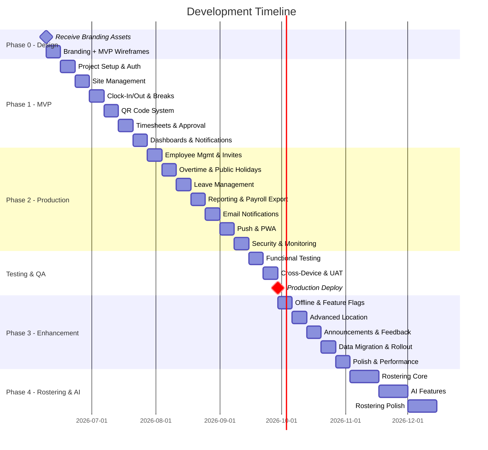

# Development Plan

## Overview

This document outlines the complete development plan for the Tyrepower Workforce Management Platform, broken into phases and sprints with clear deliverables, milestones, and dependencies.

---

## Development Methodology

- **Approach:** Agile with 1-week sprints
- **Total Estimated Duration:** 23+ weeks (5.5+ months) for core platform
- **Phases:** 6 phases (Phase 0-4, including Testing & QA) with clear milestones
- **Solo Developer:** Clifford Musni
- **Blocker:** Phase 0 cannot start until branding assets received from Nina/Lae

---

## Phase 0: Design & Branding (Week 1)

> **Goal:** Establish visual identity and wireframe MVP screens only (Phase 1 features). Remaining screens wireframed at the start of their respective sprints.
> **Prerequisite:** Branding assets from Nina/Lae (colours, fonts, logo files, brand guidelines).

### Sprint 0: Branding + MVP Wireframes (Week 1)

| Task | Description | Estimate |
|------|-------------|----------|
| Receive branding assets | Colours, fonts, logos from Nina/Lae | Blocked until received |
| Define design tokens | Primary/secondary colours, typography scale, spacing | 2h |
| TailwindCSS theme config | Map brand tokens to Tailwind config | 1h |
| Component style guide | Buttons, inputs, cards, badges in brand style | 3h |
| Mobile-first breakpoints | Define responsive breakpoints (mobile/tablet/desktop) | 1h |
| Auth screens | Login, Forgot Password, Reset Password | 1h |
| Employee screens (MVP) | Dashboard, Clock-In/Out (with breaks), Active Shift | 2h |
| Manager screens (MVP) | Dashboard, Timesheet Approval, Employee List | 2h |
| Admin screens (MVP) | Dashboard, Sites List, Site Detail/Map | 2h |
| Site landing page | `/s/:siteSlug` authenticated landing page | 1h |
| Mobile navigation | Bottom nav, touch targets | 1h |

**Phase 0 Deliverable:** Brand tokens + TailwindCSS theme configured. MVP screen wireframes in Google Stitch (auth, clock-in, timesheets, dashboards, sites). Phase 2+ screens wireframed later.

> **Note:** Wireframes for Phase 2+ features (invitations, leave, reports, etc.) are created at the start of each sprint as needed — not upfront.

---

## Phase 1: MVP Core (Weeks 2-7)

> **Goal:** Working clock-in/out system with geofencing, QR codes, timesheets with full approval workflow, and role-based dashboards.

### Sprint 1: Project Setup & Auth (Week 2)

| Task | Description | Estimate |
|------|-------------|----------|
| Project scaffold | React + Vite + TailwindCSS + TypeScript setup | 2h |
| Supabase project | Create project, configure PostGIS, enable RLS | 1h |
| Tailwind brand theme | Apply brand colours/fonts from Phase 0 | 2h |
| Database migrations | Organizations, profiles, sites tables | 3h |
| Seed test users | Create seed script: 1 admin, 1 manager, 3 employees (for Phase 1 testing) | 1h |
| Auth integration | Supabase Auth with login/forgot/reset pages | 4h |
| Protected routes | Route guards based on auth state & role | 2h |
| Role-based layout | Different nav/layout per role (mobile-first) | 3h |
| CI/CD setup | GitHub Actions + Vercel auto-deploy | 2h |
| Test infrastructure | Vitest + MSW + Playwright setup, test scripts in CI | 2h |
| Timezone handling | Store all times UTC, configure per-site IANA timezone for display | 2h |
| Environment strategy | Define dev/staging/production environments, separate Supabase projects | 1h |
| Unit tests: Auth | Test login/logout hooks, route guards, role checks | 2h |

**Sprint 1 Deliverable:** Users can log in, see role-appropriate shell layout with Tyrepower branding. Test infrastructure running in CI.

---

### Sprint 2: Site Management & Geofencing (Week 3)

| Task | Description | Estimate |
|------|-------------|----------|
| Sites CRUD | Admin can create/edit/archive sites (name, code, logo, address) | 4h |
| Map integration | Mapbox GL JS setup with site markers | 3h |
| Geofence config | Set radius, visualize boundary on map | 3h |
| PostGIS queries | ST_DWithin validation function | 2h |
| Site list page | Table/card view of all sites | 2h |
| Site landing page | `/s/:siteSlug` — authenticated page with logo, welcome, announcements | 3h |
| RLS policies | Sites table access control | 2h |
| Unit tests: Geofence | Test ST_DWithin logic, radius validation, coordinate helpers | 2h |
| Unit tests: Sites | Test CRUD operations, RLS policy enforcement | 1h |

**Sprint 2 Deliverable:** Admin can manage sites with geofences. Authenticated site landing pages working. Geofence logic unit tested.

---

### Sprint 3: Clock-In/Out & Break Tracking (Week 4)

| Task | Description | Estimate |
|------|-------------|----------|
| Shifts table | Migration + RLS (captures all shift data fields) | 2h |
| GPS capture | Browser Geolocation API integration | 2h |
| Clock-in Edge Function | Validate geofence + create shift entry | 4h |
| Clock-out Edge Function | Close shift + calculate duration | 3h |
| Clock-in UI | Big touch target button, loading state, success/error | 3h |
| Active shift display | Live timer, current hours, site name | 2h |
| Break-in/Break-out flow | Start/end break buttons during active shift (paid/unpaid toggle) | 3h |
| Breaks table | Migration (shift_id, type: paid/unpaid, start_time, end_time, duration) | 2h |
| Break duration tracking | Live break timer, auto-deduct unpaid breaks from shift total | 2h |
| Shift notes | Add notes during or after shift | 1h |
| Geofence error handling | Distance display, clear messaging | 2h |
| Unit tests: Clock-in | Test geofence validation Edge Function, GPS capture hook | 2h |
| Unit tests: Clock-out | Test duration calculation, shift closure logic | 1h |
| Unit tests: Breaks | Test break duration calc, paid/unpaid deduction, overlapping break prevention | 2h |
| E2E test: Clock-in flow | Playwright test for full clock-in → break → clock-out journey | 2h |

**Sprint 3 Deliverable:** Employees can clock in/out with GPS geofence validation, take paid/unpaid breaks (Fair Work compliant), and see live shift timer. Core clock + break logic unit tested + E2E automated.

---

### Sprint 4: QR Code System (Week 5)

| Task | Description | Estimate |
|------|-------------|----------|
| QR codes table | Migration + RLS | 1h |
| QR generation function | Unique token per site + image storage | 3h |
| QR admin UI | Generate/view/download/print per site | 3h |
| QR scanner component | react-qr-reader (camera access) | 3h |
| QR clock-in flow | Scan → validate → GPS capture → clock-in | 3h |
| QR token validation | Edge function for token check | 2h |
| Combined clock-in UI | Toggle between GPS-only and QR methods | 2h |
| Unit tests: QR | Test token generation, validation, expiry logic | 2h |
| E2E test: QR clock-in | Playwright test for QR scan → clock-in flow (mocked camera) | 1h |

**Sprint 4 Deliverable:** Full QR code system — generate per site, scan to clock-in with GPS capture. QR logic unit tested.

---

### Sprint 5: Timesheets & Approval Workflow (Week 6)

| Task | Description | Estimate |
|------|-------------|----------|
| Timesheets table | Migration with statuses: draft/submitted/reviewed/approved/rejected | 2h |
| Auto-generation logic | Group shifts into weekly timesheets | 3h |
| Break summary per shift | Show paid/unpaid break time, net worked hours (gross - unpaid breaks) | 2h |
| Submit timesheet flow | Employee reviews + submits | 3h |
| Manager review UI | View pending, mark as Reviewed | 3h |
| Approve/Reject flow | Manager actions with required notes on reject | 3h |
| Bulk approval UI | Multi-select, confirmation dialog (count/names/hours/notes) | 3h |
| Undo feature | 30-second undo after bulk approve/reject | 2h |
| Status tracking | Employee sees submission status history | 2h |
| Unit tests: Timesheets | Test auto-generation, hours calculation, overtime detection | 2h |
| Unit tests: Approval | Test bulk approve/reject logic, undo revert within timeout | 2h |
| E2E test: Timesheet flow | Playwright: submit → review → approve → employee notified | 2h |

**Sprint 5 Deliverable:** Complete timesheet workflow with all statuses, bulk approval, and undo. Approval logic fully unit tested + E2E automated.

---

### Sprint 6: Dashboards & Notifications (Week 7)

| Task | Description | Estimate |
|------|-------------|----------|
| Employee dashboard | Clock in/out, live timer, today's/weekly hours, timesheet status | 3h |
| Manager dashboard | Clocked-in count, pending timesheets, overtime alerts, labour summary | 4h |
| Admin dashboard | Total sites, active employees, hours today, pending timesheets | 3h |
| Realtime subscriptions | Live updates on dashboards | 3h |
| Notifications table | Migration + RLS | 1h |
| In-app notifications | Bell icon, notification list, mark read | 3h |
| Notification triggers | DB triggers for timesheet status changes | 2h |
| Unit tests: Notifications | Test trigger logic, notification creation, read/unread state | 1h |
| E2E test: Dashboard | Playwright test for dashboard rendering per role | 2h |

**Sprint 6 Deliverable:** Role-based dashboards with real-time updates and in-app notifications. Dashboard rendering tested per role.

---

### Milestone 1: MVP Complete ✓

**What works:**
- ✅ Tyrepower-branded UI (mobile-first, responsive)
- ✅ Authentication (login, forgot password, reset)
- ✅ Site management with geofencing
- ✅ GPS clock-in/out with geofence validation
- ✅ Break tracking (paid/unpaid, Fair Work compliant)
- ✅ QR code clock-in/out
- ✅ Live shift timer with notes
- ✅ Timesheets with full workflow (draft → submitted → reviewed → approved/rejected)
- ✅ Bulk approval with undo
- ✅ Employee, Manager, and Admin dashboards
- ✅ Real-time updates
- ✅ In-app notifications
- ✅ Authenticated site landing pages
- ✅ Multi-timezone support (UTC storage, per-site display)

**Testing users:** Seeded accounts only (1 admin, 1 manager, 3 employees via `seed.sql`). Real user onboarding via invitations starts in Phase 2.

**Ready for:** Internal testing with 1 location (Clifford + seeded accounts).

---

## Phase 2: Production Ready (Weeks 8-14)

> **Goal:** Employee management, invitation system, overtime monitoring, public holidays, leave management, reporting with payroll exports, push notifications, and PWA.

### Sprint 7: Employee Management & Invitations (Week 8)

| Task | Description | Estimate |
|------|-------------|----------|
| Invitations table | Migration (site_id, email, token, expires_at, accepted_at) | 2h |
| Invite flow (Manager) | Manager sends invitation email | 3h |
| Accept invitation page | Employee clicks link → creates password → activated | 3h |
| Employee list UI | View, suspend, reactivate, remove employees | 3h |
| Employee profiles | Name, email, mobile, employee code, status, weekly hours | 2h |
| Admin: invite managers | Super Admin invites Site Managers | 2h |
| Multi-site manager assignment | Assign manager to multiple sites | 2h |
| Unit tests: Invitations | Test token generation, expiry, acceptance logic | 2h |
| Unit tests: Employee lifecycle | Test suspend/reactivate/remove state transitions | 1h |
| E2E test: Invitation flow | Playwright: invite → email link → create account → login | 2h |

**Sprint 7 Deliverable:** Complete invitation-based onboarding and employee lifecycle management. Invitation flow E2E automated.

---

### Sprint 8: Overtime, Public Holidays & Advanced Features (Week 9)

| Task | Description | Estimate |
|------|-------------|----------|
| Overtime threshold config | Default 38 hours/week, configurable per org | 2h |
| Overtime calculation | Detect threshold breach per employee per week (net hours minus unpaid breaks) | 3h |
| Overtime dashboard widget | Employee name, weekly hours, overtime hours, status | 3h |
| Overtime warning badges | Highlight on employee list and dashboard | 2h |
| Public holidays table | Migration (date, name, state, applies_to sites) | 2h |
| AU public holiday import | Seed national + state-specific holidays (QLD, NSW, VIC, WA, SA, TAS, NT, ACT) | 2h |
| Holiday-aware reporting | Flag shifts on public holidays, identify penalty rate eligibility | 2h |
| Missed clock-out detection | 12-hour threshold + manager alert | 2h |
| Manual shift entry | Manager override with reason (admin_override method) | 3h |
| Profile management | Avatar upload, phone, password change | 2h |
| Unit tests: Overtime | Test threshold calculation, weekly hours aggregation, breach detection | 2h |
| Unit tests: Holidays | Test public holiday detection per state, correct flag on shifts | 1h |
| Unit tests: Missed clock-out | Test 12-hour detection logic | 1h |

**Sprint 8 Deliverable:** Overtime monitoring with alerts, public holiday awareness per state, missed clock-out handling, profile management. Overtime + holiday logic unit tested.

---

### Sprint 9: Leave Management (Week 10)

| Task | Description | Estimate |
|------|-------------|----------|
| Leave types config | Annual, personal/sick, unpaid, compassionate, long service | 2h |
| Leave balances table | Migration (employee_id, leave_type, accrued, taken, remaining) | 2h |
| Leave requests table | Migration (employee_id, type, start_date, end_date, status, notes) | 2h |
| Leave request flow (Employee) | Request leave with type, dates, and notes | 3h |
| Leave approval flow (Manager) | View pending, approve/reject with notes | 3h |
| Leave calendar view | Visual calendar showing team leave (manager view) | 3h |
| Leave balance display | Employee sees current balances on dashboard/profile | 2h |
| Leave impact on timesheets | Leave days appear on timesheets, don't count toward overtime | 2h |
| Leave accrual logic | Auto-accrue based on employment type (full-time/part-time/casual) | 2h |
| Unit tests: Leave | Test accrual calculation, balance deduction, overlap detection | 2h |
| Unit tests: Leave approval | Test approval state transitions, balance updates | 1h |
| E2E test: Leave flow | Playwright: request → approve → balance updated → calendar reflects | 2h |

**Sprint 9 Deliverable:** Complete leave management with requests, approvals, balance tracking, and calendar view. Fair Work compliant leave types. Leave logic unit tested + E2E automated.

---

### Sprint 10: Reporting & Export (Week 11)

| Task | Description | Estimate |
|------|-------------|----------|
| Report framework | Shared filters (date range, site, employee) + export buttons | 3h |
| Employee Hours Report | Hours by employee by site (with break breakdown) | 2h |
| Timesheet Status Report | Pending/reviewed/approved/rejected counts | 2h |
| Attendance Report | Late starts, missed clock-outs, absences | 3h |
| Overtime Report | Weekly hours, overtime hours per employee | 2h |
| Leave Report | Leave taken by type, remaining balances | 2h |
| Labour Utilisation Report | Hours by site, hours by employee | 2h |
| Daily Summary Report | Total hours, employees, avg hours, overtime, missing clock-outs | 3h |
| CSV export | Download any report as CSV | 2h |
| Excel export | XLSX generation (xlsx library) | 2h |
| PDF export | jsPDF generation with Tyrepower branding | 3h |
| Payroll export: Xero | Export timesheet data in Xero-compatible CSV format | 2h |
| Payroll export: MYOB/KeyPay | Export in MYOB and KeyPay timesheet import formats | 3h |
| Unit tests: Reports | Test data aggregation, date range filtering, calculations | 2h |
| Unit tests: Export | Test CSV/XLSX/PDF/payroll export format correctness | 2h |

**Sprint 10 Deliverable:** Full reporting module with 7 report types, CSV/Excel/PDF export, and payroll integration (Xero/MYOB/KeyPay). Report calculations unit tested.

---

### Sprint 11: Email Notifications (Week 12)

| Task | Description | Estimate |
|------|-------------|----------|
| Postmark integration | Email service setup + Edge Function | 2h |
| Invitation emails | Branded email with accept link | 2h |
| Timesheet notifications | Submitted (to manager), approved/rejected (to employee) | 3h |
| Leave request emails | Notify manager of request, notify employee of approval/rejection | 2h |
| Overtime alerts email | Manager receives weekly overtime summary | 2h |
| Email templates | Branded HTML templates (Tyrepower styling) | 3h |
| Notification preferences | User settings: opt-in/out per type | 2h |
| Unit tests: Email | Test Edge Function sends correct payload to Postmark | 1h |
| Integration test: Email | Verify invitation + approval emails trigger correctly (mocked) | 2h |

**Sprint 11 Deliverable:** Transactional email system with branded templates including leave notifications. Email triggers integration tested.

---

### Sprint 12: Push Notifications & PWA (Week 13)

| Task | Description | Estimate |
|------|-------------|----------|
| FCM setup | Firebase project + service worker | 3h |
| Push triggers | Timesheet approval, shift reminders, overtime, leave responses | 3h |
| Push preferences | User settings for push notification types | 2h |
| PWA manifest | Icons (Tyrepower branded), splash, install prompt | 2h |
| Service worker | Workbox caching strategies | 3h |
| PWA install flow | Prompt + instructions for employees | 2h |
| Mobile optimization pass | Touch targets, fast clock-in access, clean layouts | 2h |
| Unit tests: Service worker | Test caching strategies, offline detection | 1h |
| E2E test: PWA install | Verify manifest, install prompt, offline indicator | 2h |

**Sprint 12 Deliverable:** Push notifications and installable PWA with Tyrepower branding. PWA install flow E2E tested.

---

### Sprint 13: Security, Monitoring & Audit (Week 14)

| Task | Description | Estimate |
|------|-------------|----------|
| Audit logs table | Migration (user_id, action, timestamp, details, device_info) | 2h |
| Audit logging triggers | Track all key actions (login, clock, approve, leave, settings) | 3h |
| Audit log viewer | Admin UI to browse and filter audit logs | 3h |
| Device tracking | Capture device/browser info on login | 2h |
| Login activity history | User can see their login history | 2h |
| Session timeout controls | Configurable session duration | 2h |
| Security hardening | Rate limiting, input sanitization review, CSRF protection | 2h |
| Production monitoring | Sentry error tracking + BetterStack uptime monitoring | 2h |
| Database backups | Configure automated daily backups, document restore procedure | 2h |
| Deployment rollback plan | Vercel instant rollback procedure, DB migration rollback scripts | 2h |
| Admin: system settings | Manage org-level settings, branding config | 2h |
| Unit tests: Audit | Test audit log trigger captures correct actions and data | 2h |
| Unit tests: Session | Test timeout logic, device info capture | 1h |
| Integration test: RLS | Verify all tables enforce correct access per role | 3h |

**Sprint 13 Deliverable:** Audit logging, production monitoring (Sentry + uptime), automated backups, deployment rollback, device tracking, session management. Full RLS integration tested.

---

### Milestone 2: Production Ready ✓

**Additional features since MVP:**
- ✅ Invitation-based employee onboarding
- ✅ Employee suspend/reactivate/remove
- ✅ Multi-site manager assignment
- ✅ Overtime monitoring with 38-hour threshold + alerts
- ✅ Public holiday awareness (per AU state)
- ✅ Leave management (request, approve, balances, calendar)
- ✅ 7 report types with CSV/Excel/PDF export
- ✅ Payroll export (Xero/MYOB/KeyPay compatible)
- ✅ Email notifications (Postmark, branded)
- ✅ Push notifications (FCM)
- ✅ Installable PWA
- ✅ Audit logs with device tracking
- ✅ Production monitoring & alerting (Sentry + BetterStack)
- ✅ Automated database backups with restore procedure
- ✅ Deployment rollback plan
- ✅ Login activity history
- ✅ Session timeout controls
- ✅ System settings management

**Ready for:** Testing & QA phase before production deployment.

---

## Testing & QA Phase (Weeks 15-16)

> **Goal:** Thorough testing of all features before deploying to production. Identify and fix bugs, validate across devices, and get sign-off from stakeholders.

### Sprint 14: Functional Testing & Bug Fixes (Week 15)

| Task | Description | Estimate |
|------|-------------|----------|
| E2E test suite | Write Playwright tests for all critical user flows | 4h |
| Role-based testing | Test every feature as Employee, Manager, and Admin | 3h |
| Geofence testing | Verify clock-in/out at real GPS coordinates (on-site) | 2h |
| QR code testing | End-to-end QR generation, display, scan, clock-in | 2h |
| Break tracking testing | Start/end break, paid/unpaid, duration calculation | 1h |
| Timesheet workflow | Full cycle: create → submit → review → approve/reject | 2h |
| Bulk approval + undo | Test with multiple timesheets, verify 30s undo | 1h |
| Invitation flow | Full invite → accept → login → clock-in cycle | 2h |
| Leave management | Request → approve → balance update → calendar view | 2h |
| Report generation | Validate all 7 reports with test data, verify exports + payroll formats | 2h |
| Bug fix pass | Fix all issues found during testing | 4h |

**Sprint 14 Deliverable:** All critical flows tested and passing. Bug backlog cleared.

---

### Sprint 15: Cross-Device, Performance & UAT (Week 16)

| Task | Description | Estimate |
|------|-------------|----------|
| Mobile testing (iOS) | Test on iPhone Safari — all flows, touch targets | 3h |
| Mobile testing (Android) | Test on Android Chrome — all flows | 3h |
| Tablet testing | Test on iPad/tablet — layout, dashboards | 2h |
| Desktop testing | Test on Chrome/Firefox/Safari desktop | 2h |
| Performance testing | Lighthouse audit, load time, API response times | 2h |
| PWA install testing | Verify install prompt, offline indicator, push notifications | 2h |
| Timezone testing | Verify correct time display for sites in different AU timezones | 1h |
| Stakeholder UAT | Demo to relevant Tyrepower members, collect feedback | 3h |
| Final bug fixes | Address UAT feedback and remaining issues | 3h |
| Staging sign-off | Final approval to proceed to production | 1h |

**Sprint 15 Deliverable:** Tested across all target devices. Stakeholder sign-off. Ready for live deployment.

---

### Testing Checklist (Must Pass Before Production)

- [ ] All E2E tests pass (Playwright)
- [ ] Clock-in works at real Tyrepower location (GPS verified)
- [ ] Break tracking: start/end break, paid/unpaid deduction correct
- [ ] QR code scan works on iOS and Android
- [ ] Timesheets: full workflow tested with real data (includes break summary)
- [ ] Bulk approve/reject + undo works correctly
- [ ] Invitations: full flow from send to employee login
- [ ] Leave: request → approve → balance deducted → calendar updated
- [ ] All 7 reports generate correctly with CSV/Excel/PDF export
- [ ] Payroll export: Xero/MYOB/KeyPay formats import correctly
- [ ] Public holidays: correctly flagged per state
- [ ] Push notifications received on mobile
- [ ] Email notifications delivered (invitation, approvals, leave)
- [ ] PWA installs correctly on iOS and Android
- [ ] Offline clock-in queues and syncs correctly
- [ ] No console errors across all pages
- [ ] RLS verified: employees can't see other employees' data
- [ ] Session timeout works correctly
- [ ] Audit logs capture all tracked actions
- [ ] Timezone: correct time display for cross-state sites
- [ ] Performance: pages load in <3 seconds on mobile
- [ ] Accessibility: keyboard navigation, screen reader basics
- [ ] Tyrepower branding consistent across all screens
- [ ] Stakeholder demo completed and approved

---

**After Testing Phase:** Deploy to production at 1-3 locations (use feature flags for gradual rollout).

---

## Phase 3: Enhancement (Weeks 17-21)

> **Goal:** Offline support, advanced location features, announcements, data migration from existing apps, and polish for multi-site scaling.

### Sprint 16: Offline Support & Feature Flags (Week 17)

| Task | Description | Estimate |
|------|-------------|----------|
| Feature flags system | Simple JSON-based flags per org (enable/disable features per site) | 2h |
| IndexedDB setup | Local storage for offline data | 3h |
| Offline clock-in | Queue + sync mechanism | 4h |
| Sync indicator | UI for pending syncs | 2h |
| Offline data cache | Cache recent shifts and timesheets | 3h |
| Conflict resolution | Handle sync conflicts gracefully | 3h |
| Background sync | Service worker sync API | 2h |

**Sprint 16 Deliverable:** Core clock-in works offline with automatic sync. Feature flags enable gradual rollout per site.

---

### Sprint 17: Advanced Location Features (Week 18)

| Task | Description | Estimate |
|------|-------------|----------|
| Location history map | Clock-in/out points on map per employee | 3h |
| Multi-site map view (Admin) | All sites with clustering | 3h |
| Geofence boundary editor | Visual radius adjustment | 3h |
| GPS accuracy indicators | Show GPS confidence on clock-in | 2h |
| Distance display | Show how far employee is from site | 2h |
| QR code rotation | Auto-regenerate on configurable schedule | 3h |

**Sprint 17 Deliverable:** Advanced geospatial features and QR rotation.

---

### Sprint 18: Announcements & Site Management (Week 19)

| Task | Description | Estimate |
|------|-------------|----------|
| Announcements CRUD | Manager creates/edits/deletes announcements | 3h |
| Announcement display | Show on site landing page + employee dashboard | 2h |
| Site landing page editor | Manager edits logo, welcome message, contact details | 3h |
| Site branding settings | Per-site logo and welcome customization | 2h |
| Labour cost summary widget | Manager dashboard cost estimates (with penalty rate indicators) | 3h |
| Employee shift history view | Full filterable history per employee | 2h |
| In-app feedback | Bug report / feature request form for store managers | 2h |

**Sprint 18 Deliverable:** Site-specific content management, labour cost visibility, and feedback collection.

---

### Sprint 19: Data Migration & Rollout (Week 20)

| Task | Description | Estimate |
|------|-------------|----------|
| Migration tool: Deputy/Tanda | Import historical shift data from common AU workforce apps | 4h |
| Migration tool: CSV upload | Generic CSV import for shifts, employees, sites | 3h |
| Data validation & preview | Preview imported data before committing, flag conflicts | 3h |
| Duplicate detection | Identify existing employees/sites during import | 2h |
| Migration audit log | Track what was imported, by whom, from which source | 2h |
| Rollout documentation | Store manager onboarding guide, FAQ, video walkthroughs | 3h |
| Rollout plan | Phased rollout schedule (pilot → wave 1 → wave 2 → all) | 2h |

**Sprint 19 Deliverable:** Data can be imported from existing apps (Deputy, Tanda, CSV). Rollout plan and training materials ready.

---

### Sprint 20: Polish & Performance (Week 21)

| Task | Description | Estimate |
|------|-------------|----------|
| Performance audit | Lighthouse, bundle analysis, lazy loading | 2h |
| Database optimization | Index tuning, query optimization | 3h |
| Accessibility audit | WCAG 2.1 AA, screen reader, keyboard nav | 3h |
| E2E testing | Playwright tests for critical flows | 4h |
| Cross-device testing | iOS Safari, Android Chrome, tablet layouts | 3h |
| Changelog / what's new | In-app changelog for users to see latest updates | 2h |
| User documentation | Quick-start guide for managers and employees | 2h |

**Sprint 20 Deliverable:** Production-hardened, accessible, performant, well-tested application with user documentation.

---

### Milestone 3: Full Platform ✓

**Additional features since Phase 2:**
- ✅ Feature flags for gradual per-site rollout
- ✅ Offline clock-in with sync
- ✅ Advanced map features (location history, multi-site view)
- ✅ QR code rotation
- ✅ Announcements system
- ✅ Manager-editable site landing pages
- ✅ Labour cost summary (with penalty rate indicators)
- ✅ Data migration from Deputy/Tanda/CSV
- ✅ In-app feedback mechanism
- ✅ Changelog / what's new
- ✅ Rollout plan and training materials
- ✅ Performance optimized
- ✅ Accessibility compliant
- ✅ E2E tested
- ✅ Cross-device verified

**Ready for:** Multi-location scale (3-5+ sites), member rollout.

---

## Phase 4: Rostering & AI (Weeks 22-27+)

> **Goal:** Shift scheduling, roster management, and AI-powered workforce insights. Stretch goal — build when core platform is stable and in production.

### Sprint 21-22: Rostering Core (Weeks 22-23)

| Task | Description | Estimate |
|------|-------------|----------|
| Rosters table | Migration (site_id, week, status, published_at) | 2h |
| Roster shifts table | Migration (roster_id, employee_id, date, start, end) | 2h |
| Create roster UI | Manager creates weekly roster for site | 4h |
| Assign shifts | Drag-and-drop or form-based shift assignment | 4h |
| Publish roster | Publish → employees notified of their schedule | 3h |
| Employee roster view | View upcoming shifts, weekly schedule | 3h |
| Roster conflict detection | Warn if double-booked, exceeds hours, or conflicts with leave | 3h |
| Shift swap requests | Employee requests swap, manager approves | 4h |

**Sprint 21-22 Deliverable:** Working roster system with create, assign, publish, and swap.

---

### Sprint 23-24: AI Features (Weeks 24-25)

| Task | Description | Estimate |
|------|-------------|----------|
| Data analysis setup | Historical shift data aggregation | 3h |
| Overtime risk prediction | Flag employees approaching threshold | 4h |
| Labour cost forecasting | Predict weekly/monthly costs based on patterns (incl. penalty rates) | 4h |
| Attendance anomaly detection | Identify unusual patterns (late, absent, short shifts) | 4h |
| Optimal staffing suggestions | Recommend staffing levels based on historical data | 4h |
| AI-assisted rostering | Auto-generate roster based on patterns + constraints + leave | 6h |
| AI insights dashboard | Summary cards with predictions and recommendations | 3h |

**Sprint 23-24 Deliverable:** AI-powered insights and auto-rostering suggestions.

---

### Sprint 25-26: Rostering Polish & Integration (Weeks 26-27)

| Task | Description | Estimate |
|------|-------------|----------|
| Roster templates | Save and reuse common roster patterns | 3h |
| Roster notifications | Shift reminders, swap approvals, schedule changes | 3h |
| Roster reporting | Hours scheduled vs actual, coverage gaps | 3h |
| Leave integration in roster | Show leave days in roster view, prevent scheduling on leave | 3h |
| AI accuracy tuning | Refine predictions based on feedback | 4h |
| Mobile roster UX | Optimized mobile views for roster | 3h |
| Integration with timesheets | Scheduled vs actual comparison | 3h |

**Sprint 25-26 Deliverable:** Polished rostering with AI integration, leave awareness, and reporting.

---

### Milestone 4: Enterprise Platform ✓

**Additional features since Phase 3:**
- ✅ Roster creation and management
- ✅ Shift assignment and publishing
- ✅ Shift swap requests (leave-aware)
- ✅ AI overtime risk prediction
- ✅ Labour cost forecasting (with penalty rates)
- ✅ Attendance anomaly detection
- ✅ Optimal staffing suggestions
- ✅ AI-assisted auto-rostering
- ✅ Roster templates
- ✅ Scheduled vs actual reporting

**Ready for:** Enterprise operations with predictive workforce management.

---

## Timeline Summary



---

## Phase Summary

| Phase | Duration | Focus | Outcome |
|-------|----------|-------|---------|
| **Phase 0** | Week 1 | Design & Branding | MVP wireframes + design system |
| **Phase 1** | Weeks 2-7 | MVP Core | Clock-in/out with breaks, timesheets, dashboards |
| **Phase 2** | Weeks 8-14 | Production Ready | Leave, holidays, invitations, payroll export, audit, PWA |
| **Testing & QA** | Weeks 15-16 | Testing & UAT | Full testing, cross-device, stakeholder sign-off |
| **Phase 3** | Weeks 17-21 | Enhancement | Offline, data migration, feature flags, rollout |
| **Phase 4** | Weeks 22-27+ | Rostering & AI | Shift scheduling, AI insights |

---

## Dependencies & Blockers

| Dependency | Blocks | Status |
|------------|--------|--------|
| Branding assets from Nina/Lae | Phase 0 start | ⏳ Waiting |
| Phase 0 wireframes complete | Phase 1 start | Not started |
| Supabase project created | Sprint 1 | Not started |
| Mapbox account | Sprint 2 | Not started |
| Firebase project | Sprint 12 | Not started |
| Postmark account | Sprint 11 | Not started |
| BetterStack account | Sprint 13 | Not started |
| AU public holiday data source | Sprint 8 | Not started |
| Existing app access (Deputy/Tanda) | Sprint 19 (data migration) | Not needed yet |
| Production data (historical) | Phase 4 AI features | Not needed yet |

---

## Risk Mitigation

| Risk | Impact | Mitigation |
|------|--------|-----------|
| Branding assets delayed | Phase 0 blocked | Can scaffold code without branding, apply later |
| Geolocation accuracy issues | Users can't clock in | QR fallback, configurable radius buffer |
| Supabase free tier limits | App goes down | Monitor usage, upgrade before hitting limits |
| Browser GPS permission denied | Can't verify location | Clear permission instructions, QR alternative |
| Offline sync conflicts | Data inconsistency | Last-write-wins with audit log, manual resolution |
| Scope creep | Delays delivery | Strict sprint scope, P0 features only in MVP |
| Mobile browser limitations | PWA features limited | Test on target devices early, graceful degradation |
| AI predictions inaccurate | Low trust | Start with simple rules, add ML after sufficient data |
| Cross-timezone confusion | Wrong time displayed | All stored UTC, per-site IANA timezone for display |
| Payroll format changes | Exports break | Abstract format layer, unit test export structure |
| Data migration errors | Corrupted imports | Preview + validate before commit, audit trail |
| Multi-store rollout resistance | Low adoption | Feature flags for gradual rollout, training materials |

---

## Testing Strategy

### Approach: Tests Built Per Sprint

Tests are **not** deferred to a separate testing phase. Unit tests and automation tests are written **within each sprint** as features are built. The dedicated Testing & QA phase (Weeks 15-16) handles full regression, cross-device testing, and stakeholder UAT.

### Test Types

| Level | Tool | When Written | Coverage |
|-------|------|--------------|----------|
| Unit Tests | Vitest | Every sprint | Business logic, Edge Functions, hooks, utilities |
| Integration Tests | Vitest + MSW | Sprints with API work | API interactions, RLS policies, state management |
| E2E Tests (Automation) | Playwright | Every sprint (critical flows) | Full user journeys through the UI |
| Manual Testing | - | Every sprint (ad-hoc) | UI/UX, mobile responsiveness, geofencing |
| Cross-Device | BrowserStack / Real Devices | Testing & QA phase | iOS Safari, Android Chrome, tablet |

### CI Pipeline (GitHub Actions)

```yaml
# Runs on every push / PR
- Unit tests (Vitest)
- Integration tests (Vitest + MSW)
- E2E tests (Playwright - headless)
- Lint + type check
- Build verification
```

All tests must pass before code can be merged or deployed.

### Test Coverage Targets

| Area | Target | Notes |
|------|--------|-------|
| Edge Functions (business logic) | 90%+ | Clock-in validation, overtime calc, approval logic |
| Utility functions | 90%+ | Date helpers, geofence math, export formatting |
| Custom hooks | 80%+ | useAuth, useClockIn, useTimesheets |
| UI components | 60%+ | Critical flows covered by E2E instead |
| E2E critical paths | 100% | All P0 user journeys automated |

### Unit Tests Built Per Sprint

| Sprint | Unit Tests |
|--------|-----------|
| Sprint 1 | Auth hooks, route guards, role checks, timezone display |
| Sprint 2 | Geofence validation, coordinate helpers, RLS |
| Sprint 3 | Clock-in/out Edge Functions, duration calculation, break duration/deduction |
| Sprint 4 | QR token generation, validation, expiry |
| Sprint 5 | Timesheet auto-generation, hours calc (with breaks), bulk approval logic |
| Sprint 6 | Notification triggers, read/unread state |
| Sprint 7 | Invitation token logic, employee state transitions |
| Sprint 8 | Overtime threshold detection, public holiday per state, missed clock-out |
| Sprint 9 | Leave accrual, balance deduction, overlap detection, approval transitions |
| Sprint 10 | Report aggregation, export format generation, payroll format (Xero/MYOB/KeyPay) |
| Sprint 11 | Email Edge Function payloads, trigger logic (incl. leave notifications) |
| Sprint 12 | Service worker caching, offline detection |
| Sprint 13 | Audit log triggers, session timeout, RLS full suite |

### E2E Automation Tests (Playwright)

| Test | Sprint Added | Description |
|------|--------------|-------------|
| `auth.spec.ts` | Sprint 1 | Login, logout, forgot password, protected routes |
| `clock-in.spec.ts` | Sprint 3 | GPS clock-in (mocked location), break start/end, clock-out |
| `qr-clock-in.spec.ts` | Sprint 4 | QR scan → validate → clock-in |
| `timesheets.spec.ts` | Sprint 5 | Submit → review → approve/reject, bulk approve + undo |
| `dashboard.spec.ts` | Sprint 6 | Render correct widgets per role |
| `invitations.spec.ts` | Sprint 7 | Full invitation accept flow |
| `leave.spec.ts` | Sprint 9 | Request → approve → balance updated → calendar reflects |
| `pwa.spec.ts` | Sprint 12 | PWA install, offline indicator |

### Critical Test Scenarios
1. Clock-in within geofence → succeeds
2. Clock-in outside geofence → blocked with error
3. Start break → break timer active → end break → shift timer resumes
4. Unpaid break deducted from total worked hours
5. QR scan valid token → clock-in succeeds
6. QR scan expired token → error message
7. Submit timesheet → manager sees pending (with break summary)
8. Approve/reject timesheet → employee notified
9. Bulk approve with undo → reverts within 30 seconds
10. Invitation link → account creation → login works
11. Overtime threshold → warning badge appears (net of unpaid breaks)
12. Public holiday shift → flagged with penalty rate indicator
13. Leave request → approve → balance deducted → calendar shows leave
14. Leave conflict → cannot be rostered on approved leave days
15. Offline clock-in → syncs when online
16. All screens render correctly on mobile/tablet/desktop
17. RLS: Employee cannot access other employees' data
18. RLS: Manager can only see their assigned sites
19. Export: CSV/Excel/PDF files contain correct data
20. Payroll export: Xero/MYOB/KeyPay format imports correctly
21. Timezone: times display correctly for cross-state sites

---

## Definition of Done (per sprint)

- [ ] All sprint tasks completed
- [ ] **Unit tests written and passing** for new business logic
- [ ] **E2E tests written** for new critical user flows
- [ ] **All tests pass in CI** (unit + integration + E2E)
- [ ] Code reviewed (self-review checklist)
- [ ] No console errors or warnings
- [ ] Mobile responsive (tested on phone + tablet)
- [ ] Matches wireframe design from Phase 0
- [ ] Tyrepower branding correctly applied
- [ ] RLS policies verified (tested with different roles)
- [ ] Deployed to staging environment
- [ ] Key flows manually tested
- [ ] Large touch targets verified for clock-in actions
